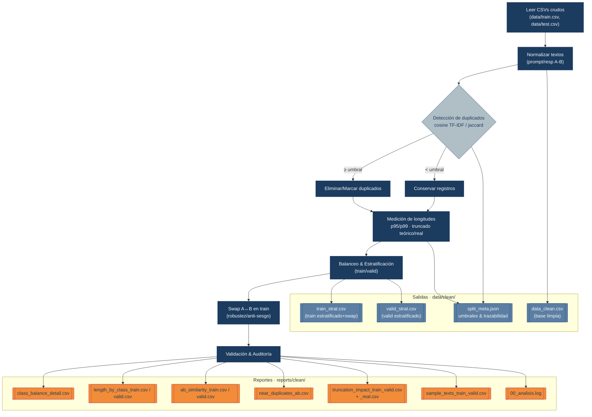

# Pipeline de Limpieza

Este módulo realiza la **limpieza, depuración y división** del dataset en subconjuntos de entrenamiento y validación, asegurando que no haya duplicados y que la información esté balanceada. Además genera métricas y reportes de calidad.

## Archivos CSV generados

### Carpeta: `data/clean/`

#### 1. `data_clean.csv`

Dataset **final limpio y depurado**, usado como entrada base para los análisis y generación de splits.
Incluye textos ya normalizados, respuestas limpias y etiquetas.
**Encabezados principales:**

```csv
prompt_clean, response_a_clean, response_b_clean, winner, prompt_sig
```

- `prompt_clean`: texto del prompt procesado.
- `response_a_clean`, `response_b_clean`: respuestas A y B ya limpiadas y truncadas.
- `winner`: indica cuál de las dos respuestas fue preferida (A o B).
- `prompt_sig`: firma hash o identificador único del prompt (sirve para agrupar o evitar duplicados).

#### 2. `train_strat.csv`

Dataset **estratificado y final para entrenamiento**.
Proviene de `data_clean.csv`, pero incluye muestras balanceadas y duplicadas estratégicamente (“swap”) para mejorar robustez del modelo.
**Encabezados principales:**

```csv
prompt_clean, response_a_clean, response_b_clean, winner, prompt_sig, split, is_swapped
```

- `split`: siempre `"train"`.
- `is_swapped`: `True` si se intercambiaron las respuestas A↔B (para balancear).

> Este es el **CSV que se usa para entrenar el modelo**.

#### 3. `valid_strat.csv`

Dataset **de validación**, generado en paralelo al de entrenamiento pero sin “swap”.
Mismos encabezados que `train_strat.csv`, con `split = "valid"` y `is_swapped = False`.

#### 4. `split_meta.json`

Este archivo guarda toda la **trazabilidad del proceso de división (split)** del dataset.
Su función es documentar **cómo se generaron los conjuntos de entrenamiento y validación**, asegurando que el proceso sea **reproducible y auditable**.

Contiene:

- **Umbrales de similitud** (coseno y jaccard): usados para decidir qué tan parecidos deben ser dos ejemplos para considerarse duplicados.
- **Conteo de duplicados eliminados o conservados:** permite saber cuántos ejemplos fueron filtrados para evitar fuga de información entre *train* y *valid*.
- **Porcentaje de prompts compartidos entre splits:** sirve para comprobar que no haya solapamiento (evita que el modelo vea el mismo prompt en ambos conjuntos).
- **p99 de longitudes:** referencia de las longitudes extremas de prompts y respuestas. Útil para decidir futuros límites de truncado.
- **Proporción de clases:** garantiza que el balance de etiquetas se mantuvo tras el split.

### Carpeta: `reports/clean/`

Los archivos de esta carpeta se generan para **evaluar la calidad y características del dataset final**, tanto global como por subconjunto (*train* / *valid*).
Son el resultado del análisis hecho por `data_summary.py`.

#### 1. `class_balance_detail.csv`

Evalúa el **equilibrio de clases** entre los conjuntos de entrenamiento y validación.
Esto es esencial para asegurar que el modelo no aprenda un sesgo hacia una clase dominante.
Si los porcentajes están muy desbalanceados, se debe revisar la estrategia de muestreo.

**Encabezados:**

```csv
split, label, count, percent
```

- `split`: indica si el registro pertenece a *train* o *valid*.
- `label`: clase o categoría (por ejemplo, respuesta ganadora A o B).
- `count` y `percent`: cantidad y proporción de ejemplos por clase.

#### 2. `length_by_class_train.csv` / `length_by_class_valid.csv`

Mide la **longitud promedio de prompts y respuestas por clase**.
Sirve para verificar si hay diferencias significativas entre los ejemplos de distintas clases (por ejemplo, si las respuestas ganadoras tienden a ser más largas).

Esto ayuda a detectar sesgos en el texto o posibles problemas de truncado que podrían afectar al modelo.

**Encabezados:**

```csv
label, mean_prompt_len, mean_respA_len, mean_respB_len, std_prompt_len, std_respA_len, std_respB_len
```

#### 3. `ab_similarity_train.csv` / `ab_similarity_valid.csv`

Calcula la **similitud entre las respuestas A y B** de cada prompt, usando métricas como `cosine_tfidf` y `jaccard_tokens`.
El objetivo es entender **qué tan diferentes son las dos respuestas comparadas**:

- Si la similitud es alta, puede indicar ejemplos redundantes o poco informativos.
- Si es muy baja, las respuestas son más diversas y útiles para entrenamiento.

**Encabezados:**

```csv
cosine_tfidf, jaccard_tokens, split, prompt_sig
```

#### 4. `near_duplicates_ab.csv`

Lista los **pares de respuestas A/B casi idénticos** (similitud ≥ 0.95).
Este reporte existe para **detectar ruido o duplicados residuales** que podrían afectar la diversidad del conjunto.

Su revisión permite decidir si se deben eliminar o mantener ciertos pares.
Es una verificación de calidad final sobre la limpieza textual.

#### 5. `truncation_impact_train_valid.csv`

Analiza el **impacto del truncado teórico** de prompts y respuestas a una longitud máxima fija (por ejemplo, 512 tokens).
Sirve para **evaluar si se están perdiendo partes relevantes del texto** y si los límites definidos son adecuados.

**Encabezados:**

```csv
split, %prompt_truncated, %respA_truncated, %respB_truncated
```

Un porcentaje alto indica que muchas muestras fueron recortadas y se debería revisar el límite.

#### 6. `truncation_impact_train_valid_real.csv`

Mismo análisis que el anterior, pero usando el **presupuesto real de tokens** que se aplicará en el modelo (con límites dinámicos).
Este es el **indicador más realista del impacto del truncado** durante el entrenamiento.
Permite anticipar pérdidas de contexto o desequilibrios en el largo de los textos.

#### 7. `sample_texts_train_valid.csv`

Contiene una **muestra aleatoria representativa** de los ejemplos de *train* y *valid*.
Se usa para **inspección manual**, con el fin de verificar que las respuestas limpias mantengan sentido, coherencia y formato esperado.

**Encabezados:**

```csv
split, prompt_clean, response_a_clean, response_b_clean, winner
```

Ideal para revisión rápida antes de entrenar el modelo o para validar la calidad subjetiva de las respuestas.

#### 8. `00_analisis.log`

Archivo de texto con el **resumen narrativo del análisis completo**.
Incluye:

- Resultados de balance de clases.
- Impactos de truncado teórico y real.
- Duplicados detectados.
- Notas adicionales o umbrales usados.

Funciona como un **registro de auditoría legible** del proceso de limpieza y análisis, útil para seguimiento de versiones o validación ante terceros.



### En resumen

| Archivo                        | Propósito principal                    |
| ------------------------------ | -------------------------------------- |
| `data_clean.csv`               | Dataset limpio y base para splits      |
| `train_strat.csv`              | Dataset final usado para entrenamiento |
| `valid_strat.csv`              | Dataset final de validación            |
| `split_meta.json`              | Metadatos del proceso y umbrales       |
| `class_balance_detail.csv`     | Balance de clases por conjunto         |
| `length_by_class_*.csv`        | Longitud promedio por clase            |
| `ab_similarity_*.csv`          | Similitud A vs B                       |
| `near_duplicates_ab.csv`       | Pares casi duplicados                  |
| `truncation_impact_*.csv`      | Efecto del truncado                    |
| `sample_texts_train_valid.csv` | Ejemplos de revisión                   |
| `00_analisis.log`              | Log final de auditoría                 |
