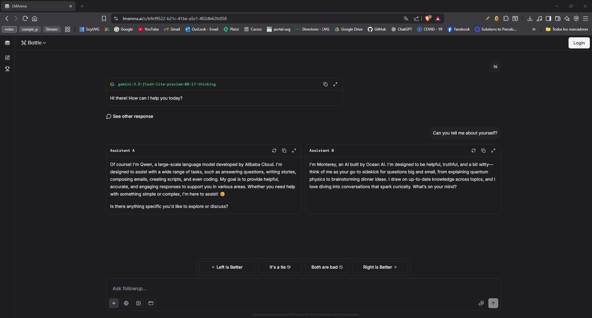
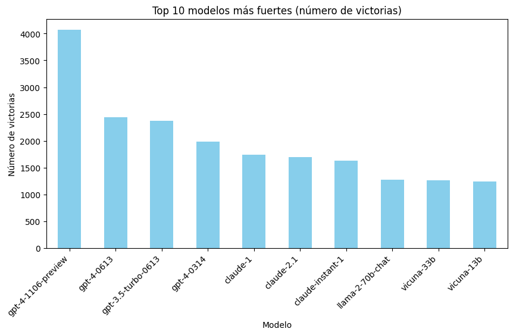
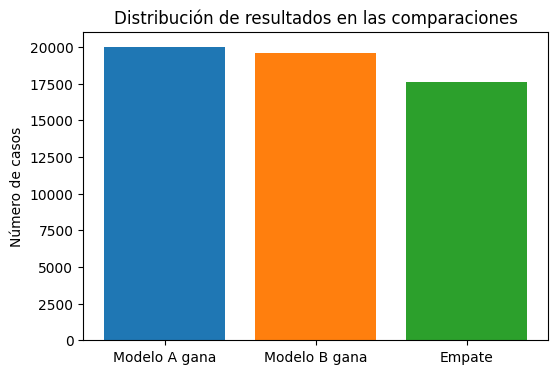
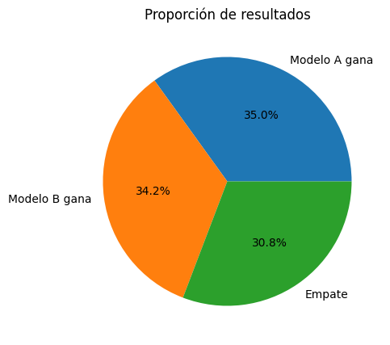

# Procesamiento del Lenguaje Natural  

## Integrantes

- Flavio Galán
- Isabella Miralles
- Josue Say
- Juan Pablo Solís

## Enlaces

- [Enlace de repositorio](https://github.com/JosueSay/Proyecto2_DS)
- [Link Kaggle](https://www.kaggle.com/competitions/lmsys-chatbot-arena)

## LMSYS - Chatbot Arena Human Preference Predictions  

Predecir qué respuesta preferirá un usuario en esta batalla cara a cara con datos del Chatbot Arena.  

## Problemática

Los modelos de lenguaje a gran escala (LLMs) son sistemas de inteligencia artificial entrenados para comprender y generar texto de manera similar a un humano, y se utilizan en asistentes virtuales, buscadores y herramientas de productividad. Sin embargo, aún existe el reto de que sus respuestas realmente coincidan con lo que los usuarios consideran más útiles o correctas.

En este marco surge **Chatbot Arena**, una plataforma en línea donde los usuarios interactúan con dos chatbots anónimos (basados en diferentes LLMs) que responden a la misma instrucción o *prompt*. Después de leer ambas respuestas, el usuario selecciona la que prefiere o puede declarar un empate. Este esquema de "batalla cara a cara" permite recopilar datos directos sobre las preferencias humanas frente a distintos modelos de IA.

Comprender y predecir estas elecciones es fundamental porque aporta información sobre cómo las personas valoran la calidad de las respuestas más allá de lo técnico. Esto resulta clave para construir sistemas conversacionales más útiles, confiables y aceptados en contextos reales, ya que la capacidad de un modelo para adaptarse a las expectativas humanas determina su éxito en aplicaciones prácticas y en la satisfacción del usuario final.

## Problema científico

¿Es posible predecir con precisión, a partir del prompt y de las dos respuestas generadas por distintos modelos, la preferencia de un usuario en una interacción cara a cara del Chatbot Arena, considerando las tres posibles clases de salida: modelo A, modelo B o empate, evaluadas mediante log loss multiclase?

## Objetivos

### Objetivo general

Desarrollar un planteamiento analítico que permita identificar patrones en los datos del Chatbot Arena y predecir la preferencia de los usuarios entre dos respuestas de modelos de lenguaje.

### Objetivos específicos

1. Analizar las características textuales de los prompts y de las respuestas para identificar factores asociados a la preferencia.
2. Describir las distribuciones de selección (A, B, empate) y su relación con las variables disponibles.
3. Evaluar la presencia de posibles sesgos en las decisiones, como el orden de presentación o la longitud de las respuestas.
4. Establecer métricas descriptivas que permitan interpretar la dificultad del problema bajo el criterio de log loss multiclase.
5. Generar una base comparativa que sirva para fases posteriores de modelado predictivo.

## Descripción del dataset

El dataset contiene alrededor de 55,000 interacciones de entrenamiento y 25,000 de prueba. Cada registro incluye:

- **id**: identificador único de la interacción.
- **prompt**: la instrucción dada por el usuario a ambos modelos.
- **response_a / response_b**: respuestas generadas por los dos modelos en competencia.
- **model_a / model_b**: identidad de los modelos (sólo visible en entrenamiento).
- **winner_model_a / winner_model_b / winner_tie**: variables binarias que indican la preferencia del juez.

## Investigación preliminar sobre Chatbot Arena

### ¿Qué es Chatbot Arena?

Chatbot Arena es una plataforma abierta en línea para evaluar modelos de lenguaje a gran escala (LLMs) mediante comparaciones por pares basadas en la preferencia humana. Los usuarios ingresan un *prompt* libre, reciben dos respuestas generadas por modelos distintos (anónimos al inicio) y luego votan por la que consideran mejor. Solo después de emitir el voto se revela qué modelo produjo cada respuesta.

### Escala y diversidad de los datos

Desde su lanzamiento en 2023, la plataforma ha recopilado más de **240,000 votos** de alrededor de **90,000 usuarios** en más de **100 idiomas**. Los prompts cubren una amplia gama de temas como programación, matemáticas, poesía, recetas, filosofía, consultas médicas y temas cotidianos. Esto asegura que los datos reflejen escenarios cercanos a la realidad y no únicamente tareas diseñadas en contextos académicos.

### Modelos incluidos

En la plataforma se han evaluado **más de 50 modelos**. Entre los más destacados se encuentran:

- **GPT-4-Turbo**, **GPT-4-0613**, **GPT-3.5-Turbo-0613** (OpenAI).
- **Claude-2.1**, **Claude-Instant-1** (Anthropic).
- **Gemini-Pro** y **Gemini-Pro-Dev** (Google DeepMind).
- **Mistral-7B-Instruct**, **Mixtral-8x7B-Instruct**, **Mistral-Medium** (Mistral AI).
- **LLaMA-2-7B**, **LLaMA-2-13B**, **LLaMA-2-70B-Chat** (Meta).

De acuerdo con las métricas, los modelos propietarios como **GPT-4** y **Claude-2.1** tienden a tener mayor tasa de victorias, especialmente en dominios de razonamiento complejo o programación. Sin embargo, modelos abiertos como **LLaMA-2-70B** y **Mixtral** han mostrado un desempeño competitivo en tareas más generales.

### Votos por modelo

- Cada modelo acumula en promedio unos **8,000 votos**.
- Se emplea un esquema de **muestreo no uniforme**, priorizando enfrentamientos entre modelos de rendimiento similar, lo que hace más eficiente la recolección de datos y facilita detectar diferencias sutiles en calidad.

### Validación de la calidad de las preferencias

Los votos de usuarios fueron comparados con evaluaciones de expertos y juicios automatizados de modelos como GPT-4. Los resultados muestran una **concordancia del 72–83%** entre las elecciones del público y las de los especialistas. Esto confirma la fiabilidad del enfoque, aunque ciertos prompts sin una respuesta única pueden generar discrepancias razonables.

### Limitaciones identificadas

- **Perfil de usuarios:** la mayoría son investigadores o entusiastas de LLMs, lo que sesga los tipos de prompts hacia intereses técnicos.
- **Enfoque limitado:** la evaluación se centra en la "utilidad" percibida de las respuestas, dejando en segundo plano aspectos críticos como la **seguridad** o la detección de sesgos dañinos.
- **Comparaciones binarias:** cada batalla enfrenta solo **dos modelos a la vez**, lo cual simplifica el proceso de votación, pero limita la posibilidad de comparar simultáneamente múltiples respuestas. Para propósitos de investigación esto es útil (permite estimar rankings relativos con modelos estadísticos como *Bradley-Terry*), pero desde la perspectiva de la experiencia de usuario no refleja un escenario donde uno podría elegir entre varias alternativas al mismo tiempo.
- **Selección de modelos a enfrentar:** los pares se eligen con un algoritmo de **muestreo activo**, diseñado para mostrar con mayor frecuencia modelos de rendimiento cercano. Esto acelera la convergencia de los rankings y hace más eficiente la recolección de datos, aunque restringe la cobertura de comparaciones posibles entre todos los modelos.

## Análisis inicial del problema y de los datos disponibles

El dataset de **LMSYS - Chatbot Arena** contiene **57,250 observaciones** en train y unas **25,000 en test**. Cada registro representa un duelo entre dos modelos de lenguaje (A vs. B) sobre un mismo *prompt*. Las variables incluyen identificadores, textos de entrada (prompt, response_a, response_b) y salidas binarias que indican la preferencia del juez (ganó A, ganó B, empate). Además, se listan los nombres de los modelos, aunque sólo en train. La naturaleza de los datos es mixta: **categórica** (model_a, model_b), **texto libre** (prompt y respuestas) y **binaria** (etiquetas de ganador).

## Preprocesamiento de datos

Se aplicaron varias etapas para limpiar y normalizar el texto:

- Conversión de arrays en columnas (`prompt`, `response_a`, `response_b`) a cadenas unificadas.
- Relleno de valores nulos con cadenas vacías.
- Normalización de codificación y Unicode para eliminar caracteres corruptos.
- Desescape de HTML (& -> &).
- Eliminación de URLs, menciones, hashtags, emojis, símbolos y puntuación redundante.
- Conversión a minúsculas y reducción de espacios.
- Remoción de *stopwords* en inglés.
- Filtrado de filas vacías tras la limpieza.

El resultado fue un dataset con columnas adicionales `prompt_clean`, `response_a_clean`, `response_b_clean` listas para análisis exploratorio.

## Análisis exploratorio de datos (EDA)

1. **Variables y observaciones:**

   - 57,250 filas × 12 columnas tras limpieza.
   - 64 modelos distintos en `model_a` y `model_b`.
   - 51,636 prompts únicos, algunos repetidos hasta 101 veces.

2. **Distribuciones y resúmenes:**

   - Los resultados están relativamente balanceados: \~35% victorias modelo A, \~34% modelo B, \~31% empates.
   - Modelos con más victorias: *gpt-4-1106-preview*, *gpt-4-0613*, *gpt-3.5-turbo-0613*.

3. **Tablas de frecuencia:**

   - Los saludos simples (“hello!”, “sorry, can’t assist”) son respuestas muy frecuentes, lo que puede sesgar la predicción.
   - `model_a` y `model_b` muestran concentración en pocos modelos de alto rendimiento.

4. **Modelos más fuertes:**

   - Al analizar el número de victorias totales por modelo, se identifican tendencias claras. La Figura 2 muestra los **10 modelos con más victorias acumuladas** en los enfrentamientos.
   - Destaca **gpt-4-1106-preview** con más de 4,000 victorias, seguido por **gpt-4-0613** y **gpt-3.5-turbo-0613**, ambos con cifras cercanas a 2,400.
   - Modelos de Anthropic como **Claude-1** y **Claude-2.1** también figuran con un buen número de victorias, aunque en menor proporción que los GPT de OpenAI.
   - En el grupo medio aparecen modelos abiertos como **LLaMA-2-70B-chat**, lo que indica que, aunque los modelos propietarios dominan, algunos modelos open-source compiten de forma relativamente sólida.

5. **Cruces de variables:**

   - La gráfica de **distribución de resultados en las comparaciones**. Se observa que los conteos son muy similares para victorias de A y B (ambos alrededor de 20,000), mientras que los empates se ubican en torno a 17,500 casos.
   - Esta representación complementa el gráfico circular, pues muestra en números absolutos cómo están distribuidas las clases. Además, permite identificar que aunque existe balance entre A y B, los empates podrían necesitar un tratamiento especial en modelado debido a su menor frecuencia relativa.

### Visualizaciones del análisis

Muestra los modelos con más victorias acumuladas. Destaca el dominio de variantes de GPT-4 y GPT-3.5, seguidos por modelos de Anthropic y algunos open-source como LLaMA-2.

Esto muestra el número absoluto de casos por clase. Refuerza la idea de que las tres categorías están presentes en volúmenes similares, aunque con cierta menor representación de empates.

Representa en forma de gráfico circular la participación relativa de cada clase (A gana, B gana, Empate).

## Conclusiones  

Redactar un resumen con los principales hallazgos y posibles implicaciones para etapas posteriores del proyecto.  

## Referencias

- [Chatbot Arena: An Open Platform for Evaluating LLMs by Human Preference](https://arxiv.org/abs/2403.04132)
