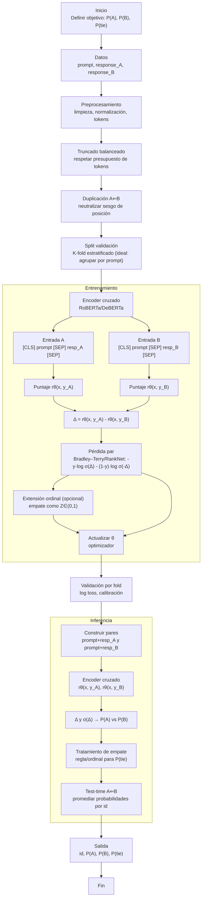

# Workflow

```mermaid
flowchart 
    A[Inicio<br>Definir objetivo: P#40;A#41;, P#40;B#41;, P#40;tie#41;] --> B[Datos<br>prompt, response_A, response_B]
    B --> C[Preprocesamiento<br>limpieza, normalización, tokens]
    C --> D[Truncado balanceado<br>respetar presupuesto de tokens]
    D --> E[Duplicación A#8656;B<br>neutralizar sesgo de posición]
    E --> F[Split validación<br>K-fold estratificado #40;ideal: agrupar por prompt#41;]

    subgraph Entrenamiento
        direction TB
        G[Encoder cruzado<br>RoBERTa/DeBERTa]
        G --> H_A[Entrada A<br>#91;CLS#93; prompt #91;SEP#93; resp_A #91;SEP#93;]
        G --> H_B[Entrada B<br>#91;CLS#93; prompt #91;SEP#93; resp_B #91;SEP#93;]
        H_A --> I_A[Puntaje rθ#40;x, y_A#41;]
        H_B --> I_B[Puntaje rθ#40;x, y_B#41;]
        I_A --> J[Δ = rθ#40;x, y_A#41; - rθ#40;x, y_B#41;]
        I_B --> J
        J --> K[Pérdida par<br>Bradley–Terry/RankNet: -y·log &sigma;#40;Δ#41; - #40;1-y#41;·log &sigma;#40;-Δ#41;]
        K --> L[Extensión ordinal #40;opcional#41;<br>empate como Z∈#40;0,1#41;]
        L --> M[Actualizar θ<br>optimizador]
        K --> M
    end

    F --> G
    M --> N[Validación por fold<br>log loss, calibración]

    subgraph Inferencia
        direction TB
        O[Construir pares<br>prompt+resp_A y prompt+resp_B]
        O --> P[Encoder cruzado<br>rθ#40;x, y_A#41;, rθ#40;x, y_B#41;]
        P --> Q[Δ y &sigma;#40;Δ#41; → P#40;A#41; vs P#40;B#41;]
        Q --> R[Tratamiento de empate<br>regla/ordinal para P#40;tie#41;]
        R --> S[Test-time A#8656;B<br>promediar probabilidades por id]
    end

    N --> O
    S --> T[Salida<br>id, P#40;A#41;, P#40;B#41;, P#40;tie#41;]
    T --> U[Fin]
```
